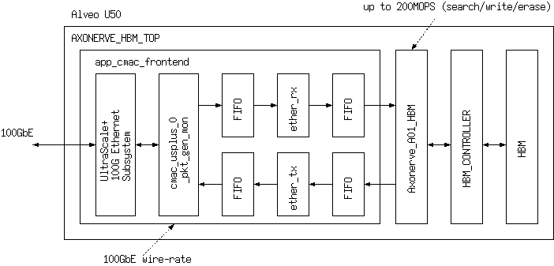
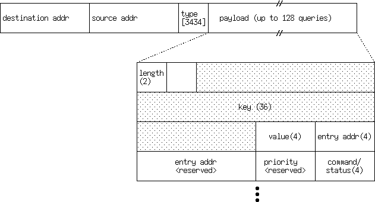

# KVS with Axonerve and 100GbE on AU50

## Overview

This is an example of KVS implementation with Axonerve and 100GbE on Alveo U50. The bit-width of key and value is 288-bit and 32-bit, respectively. The maximum number of entries is 67,108,864, because of  Axonerve capacity.

The below block diagram shows the architecture. 



You can emit SEARCH, WRITE, and DELETE commands into the KVS via 100GbE. The below figure shows the packet format of commands.



The Ethernet type `0x3434` indicate the packet includes KVS queries. The number of octets in a query is 64. In case the number of queries exceeds 23, Ethernet MTU should be set appropriately to make jumbo-frame available.

The bit assignments of command/status fields are as followings

| bit | command |
|:---:|:--------|
| 0   | erase   |
| 1   | write   |
| 4   | search  |

| bit | status              |
|:---:|:--------------------|
| 0   | single hit          |
|     |                     |
| 3:2 | Axonerve error code |

## Getting Started

1. Download [AXONERVE_HBM_TOP.bit](./bin/AXONERVE_HBM_TOP.bit) and [AXONERVE_HBM_TOP.ltx](./bin/AXONERVE_HBM_TOP.ltx)
1. Configure Alveo U50 with the bit-stream and the ltx file.
1. Run test script [raw_axonerve_util.py](./software/raw_axonerve_util.py).
1. The available bit-file is 5min. limited version.

## Building bit-file with Vivado

### Pre-requirements

* Vivado 2019.2.1
* Xilinx 100GbE MAC license (available [here](https://www.xilinx.com/products/intellectual-property/cmac_usplus.html)
* Alveo U50 board definition file (put the files at `$XILINX_VIVADO/data/boards/board_files/au50/` )

### Building Steps

* Clone this repository
* Put AXONERVE_A01_HBM_all.vp at `axonerve/`
* Run tcl script (`create_project.tcl`) to build

```
% git clone --recursive https://github.com/miyo/axonerve_kvs_on_au50.git
% cd axonerve_kvs_on_au50
% vivado -mode batch -source ./create_project.tcl
```

* After compilation, you can get `prj/axonerve_etherif.runs/impl_1/AXONERVE_HBM_TOP.bit`

## Software Development

### Python library

Pyhton users can use [raw_axonerve_util.py](./software/raw_axonerve_util.py) as a library. Please see [raw_axonerve_se.py](./software/raw_axonerve_se.py), [raw_axonerve_we.py](./software/raw_axonerve_we.py), and [raw_axonerve_reset.py](./software/raw_axonerve_reset.py) to know how to use it.

### Performance checker

Axonerve in this reference can handle queries up to 200M queries/sec, theoretically. Due to 100GbE limits, the maximum performance is about 190M queries/sec. You can check the performance by using [perf_check.c](./software/perf_check.c).

## An example of Execution

```
$ sudo python3 raw_axonerve_util.py enp3s0f
*** test (search-write-search-erase-search) ***
search
[[b'\x00\x00\x00\x00', b'\x00\x00\x00\x00']]
write
[[b'\x00!L\xcf', b'\x00\x00\x00\x00']]
search
[[b'4444', b'\x00\x00\x00\x01']]
erase
[[b'\x00!L\xcf', b'\x00\x00\x00\x00']]
search
[[b'\x00\x00\x00\x00', b'\x00\x00\x00\x00']]
*** test (search-write-search-erase-search) 2 items ***
search (2 keys)
[[b'\x00\x00\x00\x00', b'\x00\x00\x00\x00'], [b'\x00\x00\x00\x00', b'\x00\x00\x00\x00']]
write (2 key-values)
[[b'\x00!L\xcf', b'\x00\x00\x00\x00'], [b'\x00\x0f\xb7\xe5', b'\x00\x00\x00\x00']]
search (2 keys)
[[b'4444', b'\x00\x00\x00\x01'], [b'\xde\xad\xbe\xef', b'\x00\x00\x00\x01']]
erase (2 keys)
[[b'\x00!L\xcf', b'\x00\x00\x00\x00'], [b'\x00\x0f\xb7\xe5', b'\x00\x00\x00\x00']]
search (2 keys)
[[b'\x00\x00\x00\x00', b'\x00\x00\x00\x00'], [b'\x00\x00\x00\x00', b'\x00\x00\x00\x00']]
*** test (write-search-reset-search) ***
write (2 key-values)
[[b'\x00!L\xcf', b'\x00\x00\x00\x00'], [b'\x00\x0f\xb7\xe5', b'\x00\x00\x00\x00']]
search (2 keys)
[[b'4444', b'\x00\x00\x00\x01'], [b'\xde\xad\xbe\xef', b'\x00\x00\x00\x01']]
reset
search (2 keys)
[[b'\x00\x00\x00\x00', b'\x00\x00\x00\x00'], [b'\x00\x00\x00\x00', b'\x00\x00\x00\x00']]
*** test (search-write-search-erase-search) 16 items ***
search
[b'\x00\x00\x00\x00', b'\x00\x00\x00\x00']
[b'\x00\x00\x00\x00', b'\x00\x00\x00\x00']
[b'\x00\x00\x00\x00', b'\x00\x00\x00\x00']
[b'\x00\x00\x00\x00', b'\x00\x00\x00\x00']
[b'\x00\x00\x00\x00', b'\x00\x00\x00\x00']
[b'\x00\x00\x00\x00', b'\x00\x00\x00\x00']
[b'\x00\x00\x00\x00', b'\x00\x00\x00\x00']
[b'\x00\x00\x00\x00', b'\x00\x00\x00\x00']
[b'\x00\x00\x00\x00', b'\x00\x00\x00\x00']
[b'\x00\x00\x00\x00', b'\x00\x00\x00\x00']
[b'\x00\x00\x00\x00', b'\x00\x00\x00\x00']
[b'\x00\x00\x00\x00', b'\x00\x00\x00\x00']
[b'\x00\x00\x00\x00', b'\x00\x00\x00\x00']
[b'\x00\x00\x00\x00', b'\x00\x00\x00\x00']
[b'\x00\x00\x00\x00', b'\x00\x00\x00\x00']
[b'\x00\x00\x00\x00', b'\x00\x00\x00\x00']
write
[b'\x00\x08#\xeb', b'\x00\x00\x00\x00']
[b'\x00\n\xe6\xcd', b'\x00\x00\x00\x00']
[b'\x00.\xb3r', b'\x00\x00\x00\x00']
[b'\x00,vT', b'\x00\x00\x00\x00']
[b'\x00\x13&\xe2', b'\x00\x00\x00\x00']
[b'\x00\x11\xe3\xc4', b'\x00\x00\x00\x00']
[b'\x005\xb6{', b'\x00\x00\x00\x00']
[b'\x007s]', b'\x00\x00\x00\x00']
[b'\x00\x08\xa2o', b'\x00\x00\x00\x00']
[b'\x00\ngI', b'\x00\x00\x00\x00']
[b'\x00.2\xf6', b'\x00\x00\x00\x00']
[b'\x00,\xf7\xd0', b'\x00\x00\x00\x00']
[b'\x00\x13\xa7f', b'\x00\x00\x00\x00']
[b'\x00\x11b@', b'\x00\x00\x00\x00']
[b'\x0057\xff', b'\x00\x00\x00\x00']
[b'\x007\xf2\xd9', b'\x00\x00\x00\x00']
search
[b'\x00\x00\x00\x00', b'\x00\x00\x00\x01']
[b'\x01\x01\x01\x01', b'\x00\x00\x00\x01']
[b'\x02\x02\x02\x02', b'\x00\x00\x00\x01']
[b'\x03\x03\x03\x03', b'\x00\x00\x00\x01']
[b'\x04\x04\x04\x04', b'\x00\x00\x00\x01']
[b'\x05\x05\x05\x05', b'\x00\x00\x00\x01']
[b'\x06\x06\x06\x06', b'\x00\x00\x00\x01']
[b'\x07\x07\x07\x07', b'\x00\x00\x00\x01']
[b'\x08\x08\x08\x08', b'\x00\x00\x00\x01']
[b'\t\t\t\t', b'\x00\x00\x00\x01']
[b'\n\n\n\n', b'\x00\x00\x00\x01']
[b'\x0b\x0b\x0b\x0b', b'\x00\x00\x00\x01']
[b'\x0c\x0c\x0c\x0c', b'\x00\x00\x00\x01']
[b'\r\r\r\r', b'\x00\x00\x00\x01']
[b'\x0e\x0e\x0e\x0e', b'\x00\x00\x00\x01']
[b'\x0f\x0f\x0f\x0f', b'\x00\x00\x00\x01']
erase
[b'\x00\x08#\xeb', b'\x00\x00\x00\x00']
[b'\x00\n\xe6\xcd', b'\x00\x00\x00\x00']
[b'\x00.\xb3r', b'\x00\x00\x00\x00']
[b'\x00,vT', b'\x00\x00\x00\x00']
[b'\x00\x13&\xe2', b'\x00\x00\x00\x00']
[b'\x00\x11\xe3\xc4', b'\x00\x00\x00\x00']
[b'\x005\xb6{', b'\x00\x00\x00\x00']
[b'\x007s]', b'\x00\x00\x00\x00']
[b'\x00\x08\xa2o', b'\x00\x00\x00\x00']
[b'\x00\ngI', b'\x00\x00\x00\x00']
[b'\x00.2\xf6', b'\x00\x00\x00\x00']
[b'\x00,\xf7\xd0', b'\x00\x00\x00\x00']
[b'\x00\x13\xa7f', b'\x00\x00\x00\x00']
[b'\x00\x11b@', b'\x00\x00\x00\x00']
[b'\x0057\xff', b'\x00\x00\x00\x00']
[b'\x007\xf2\xd9', b'\x00\x00\x00\x00']
search
[b'\x00\x00\x00\x00', b'\x00\x00\x00\x00']
[b'\x00\x00\x00\x00', b'\x00\x00\x00\x00']
[b'\x00\x00\x00\x00', b'\x00\x00\x00\x00']
[b'\x00\x00\x00\x00', b'\x00\x00\x00\x00']
[b'\x00\x00\x00\x00', b'\x00\x00\x00\x00']
[b'\x00\x00\x00\x00', b'\x00\x00\x00\x00']
[b'\x00\x00\x00\x00', b'\x00\x00\x00\x00']
[b'\x00\x00\x00\x00', b'\x00\x00\x00\x00']
[b'\x00\x00\x00\x00', b'\x00\x00\x00\x00']
[b'\x00\x00\x00\x00', b'\x00\x00\x00\x00']
[b'\x00\x00\x00\x00', b'\x00\x00\x00\x00']
[b'\x00\x00\x00\x00', b'\x00\x00\x00\x00']
[b'\x00\x00\x00\x00', b'\x00\x00\x00\x00']
[b'\x00\x00\x00\x00', b'\x00\x00\x00\x00']
[b'\x00\x00\x00\x00', b'\x00\x00\x00\x00']
[b'\x00\x00\x00\x00', b'\x00\x00\x00\x00']
$ 
```
